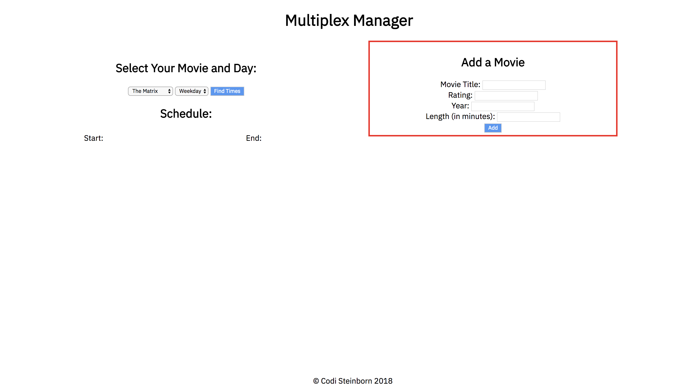
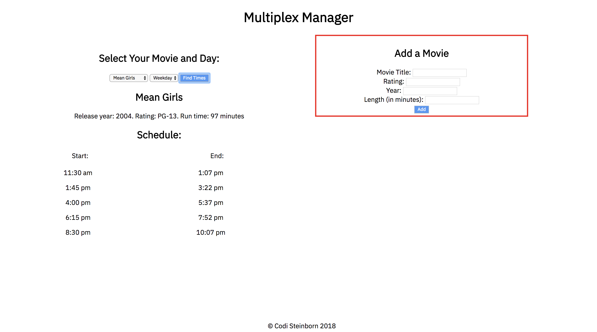

# Multiplex Manager
GitHub Repository - <https://github.com/codisteinborn/MultiplexManager> \

## Introduction
The Multiplex Manager is an application built for theatre scheduling. Assuming the multiplex contains multiple screens, each playing a different movie throughout the day, the manager app will create a schedule of start and end times for each movie. The generated schedule takes into account previews as well as cleaning times in between showings.

## User Guide
In order to look up a schedule for a specific movie, select the movie and type of day from the dropdown lists and click the "Find Times" button. You will see movie details, as well as the start and end times displayed on the page.
Users also have the option to add movies to the schedule. To do so, enter in a movie's title, rating, release year, and length (in minutes) and click the "Add" button. The movie will now be selectable from the movie dropdown list.

## EXAMPLE
Here is a list of the rules for each viewing of a movie in this example scenario.
- Each movie should start at easy to read times (eg 10:00, 10:05, 10:10).
- The runtime of each movie does not include time for previews or cleanup.
- The start time of the movie is exactly at the posted start time.
- Each movie requires 15 minutes for previews before the start of the movie.
- Each movie requires 20 minutes after its end time to prepare the theatre for the next movie.
- The theatre has the following hours of operation: Weekdays 11am - 11pm. Weekends 10:30am - 12am.
- The cinema requires 15 minutes after opening before the first movie is shown.
- No movie should end after the cinema’s hours of operation.
- The last showing should end as close as possible to the end of the cinema’s hours of operation.

Below is a screenshot from the Multiplex Manager showing movie times from Mean Girls on a weekday.

## Built Utilizing
jQuery - <http://api.jquery.com/> \
Google Fonts - <https://fonts.google.com/> 

# Original Contributor:
Codi Steinborn  - <https://github.com/codisteinborn/> 